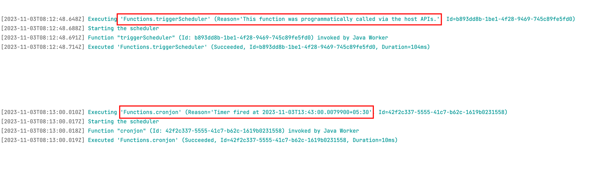

### AZURE_FUNCTIONS_IMPLEMENTATION WITH SCHEDULER & HTTP METHOD

### Local Azure Setup
~~~
brew tap azure/functions
brew install azure-functions-core-tools@4
brew install azure/functions/azure-functions-core-tools

vi ~/.zshrc

alias func="/opt/homebrew/Cellar/azure-functions-core-tools@4/4.0.5441/func"
export PATH="/opt/homebrew/Cellar/azure-functions-core-tools/2.7.3188:$PATH"
~~~
### Start the local azure-storage using docker
~~~
docker run -d --name azure-storage -p 10000:10000 -p 10001:10001 -p 10002:10002 mcr.microsoft.com/azure-storage/azurite
~~~

### Run using below commands
~~~
./mvnw clean package
./mvnw azure-functions:run
~~~

